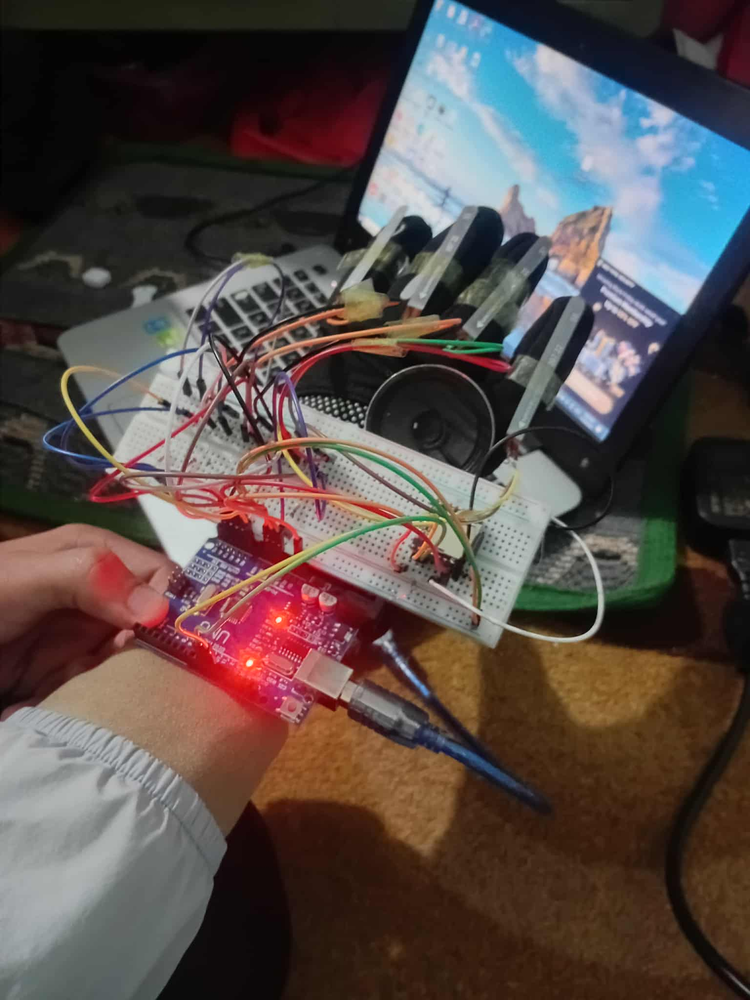

<html lang="en">
<body>
  

    <header>
      
      

        <h1>Gesture-to-Speech Device</h1>
        
A wearable that converts hand gestures into spoken audio using flex sensors, an Arduino, and a DFPlayer Mini.

        
GitHub-friendly README (HTML)

      

    </header>

  

      <main class="card section">
        <h2>Project Description</h2>
        
The Gesture-to-Speech Device maps finger-bending gestures to pre-recorded audio files. Each finger uses a flex sensor; when the user bends a finger beyond a calibrated threshold, the system triggers a specific audio clip via the DFPlayer Mini. This project is handy for assistive communication prototypes and HCI experiments.

  <h2>How It Works</h2>
        <ol>
          <li>Flex sensors are attached to five fingers (or to the fingers you choose to support).</li>
          <li>The flex sensors form part of an analog voltage divider that the Arduino reads on analog input pins.</li>
          <li>The Arduino continuously samples the analog values and compares them against calibrated thresholds.</li>
          <li>When a sensor value indicates a bend, the Arduino identifies the gesture and sends a serial command to the DFPlayer Mini.</li>
          <li>The DFPlayer Mini plays the corresponding audio file through the connected speaker.</li>
        </ol>

  <h2>How Flex Sensors Work</h2>
        
Flex sensors are variable resistors whose resistance increases as they bend. By measuring the voltage from a voltage divider (flex sensor + fixed resistor), the Arduino can infer the bending amount.

        <pre><code>// Typical wiring for one flex sensor (Arduino analog read)
// A0 ----> voltage divider output --> flex sensor + pull-down resistor
// 5V ----> flex sensor --> node --> resistor --> GND

int sensorValue = analogRead(A0);
</code></pre>

  <h2>Files & Assets</h2>
        <ul>
          <li><strong>Circuit diagram:</strong> <code>pictures/Circuit-Diagram-696x453.png</code></li>
          <li><strong>Prototype photo:</strong> <code>pictures/demo.jpg</code></li>
          <li><strong>Arduino code:</strong> add your <code>gesture_to_speech.ino</code> file to the repo and link it here.</li>
        </ul>

<h2>Suggested Repository Structure</h2>
        <pre><code>/
├─ README.html  (this file)
├─ pictures/
│  ├─ Circuit-Diagram-696x453.png
│  └─ demo.jpg
├─ code/
│  └─ gesture_to_speech.ino
├─ audio/
│  ├─ 001_hello.mp3
│  └─ 002_help.mp3
└─ docs/
   └─ calibration.md
</code></pre>

  <h2>Components (example)</h2>
        <ul>
          <li>Arduino Uno / Nano</li>
          <li>Flex sensors ×5</li>
          <li>DFPlayer Mini + microSD with MP3 files</li>
          <li>Speaker</li>
          <li>Resistors (10kΩ recommended for voltage divider)</li>
          <li>Jumper wires, breadboard or perfboard</li>
        </ul>
<h2>Calibration Tips</h2>
        
Record baseline readings for each sensor when the hand is straight, then record readings when fully bent. Choose a threshold somewhere between the two (e.g., midpoint). Store thresholds in EEPROM or run a calibration routine at startup.

  <h2>Next Steps / Improvements</h2>
        <ul>
          <li>Add a calibration page or script (<code>docs/calibration.md</code>).</li>
          <li>Include the full Arduino source under <code>/code</code>.</li>
          <li>Consider a Bluetooth or ESP32 version for wireless audio control.</li>
          <li>Add an OLED display for visual feedback of detected gestures.</li>
        </ul>
       <footer>
          
Made with ♥ — add any license or contribution guidelines to the repo as needed.

        </footer>
      </main>
  <aside class="card toc">
        <h3>Quick Links</h3>
        <ul>
          <li><a href="#project-description">Project Description</a></li>
          <li><a href="#how-it-works">How It Works</a></li>
          <li><a href="#how-flex-sensors-work">How Flex Sensors Work</a></li>
          <li><a href="#files--assets">Files & Assets</a></li>
          <li><a href="#components-example">Components</a></li>
        </ul>
    

          <h4>Circuit Diagram</h4>
          

        

      </aside>
    

  

</body>
</html>
